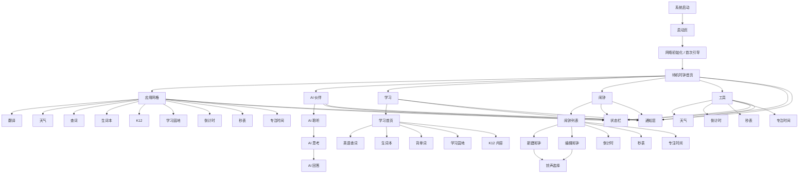
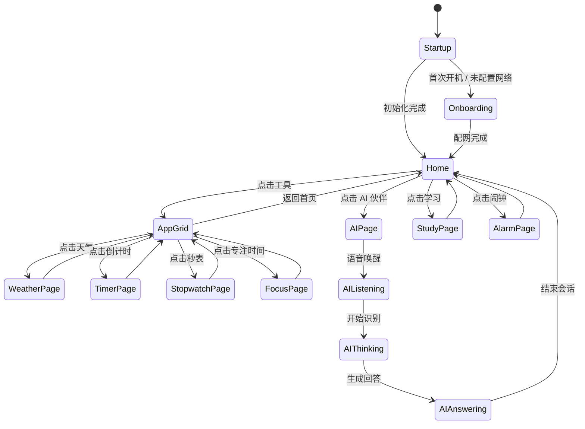

# ESP32-Alarm UI 页面设计

## 1. 文档目标

本文档描述 `esp32-alarm` 的完整 UI 页面体系，输出：

- UI 页面结构图
- 页面清单
- 页面状态流转图
- 素材需求
- 与旧 UI 的对比说明

本产品的 UI 不是单一页面，而是一套运行在设备上的 `桌面式轻系统`，支持：

- 触摸交互
- 语音交互
- 闹钟、学习、工具、AI 入口承载
- `Wi-Fi + ML307C` 双网络状态展示

## 2. UI 系统定位

### 2.1 新 UI 的定位

`esp32-alarm` 的 UI 目标是做成一套面向儿童学习陪伴场景的桌面式系统，而不是传统意义上的设备状态屏。

它的核心特征是：

- 首页是桌面
- 应用以网格方式组织
- 重要能力以独立页面承载
- 语音与触摸共享同一套状态层
- 状态栏持续展示网络、电量和提醒信息

### 2.2 与旧 UI 的对比

| 对比项 | 旧 UI（lichuang-dev） | 新 UI（esp32-alarm） |
| --- | --- | --- |
| 设计目标 | 设备展示屏 / 功能页 | 桌面式轻系统 / 产品主界面 |
| 页面组织 | 以单个显示页为中心 | 以首页 + 应用网格 + 子页面为中心 |
| 交互方式 | 偏展示，交互较弱 | 触摸 + 语音 + 状态驱动 |
| 页面生命周期 | 页面切换简单 | 页面状态、悬浮层、通知层并存 |
| 功能承载 | 单点功能展示 | 闹钟、学习、AI、工具统一承载 |
| 网络感知 | 偏基础状态 | 明确展示 Wi-Fi / 4G / 无网络 |
| 产品感受 | 更像设备屏幕 | 更像一台小系统终端 |

### 2.3 新 UI 的核心概念

- `桌面首页`：设备默认落点，承接时间、状态和高频入口
- `应用网格`：承载二级功能入口
- `任务页面`：天气、倒计时、秒表、专注时间等具体功能页
- `系统层`：状态栏、通知条、弹窗、语音浮层
- `AI 层`：AI 聆听、思考、回答的全局覆盖态

## 3. UI 页面结构图

## 4. 页面状态流转图

## 5. 页面清单

### 5.1 系统层页面

- 启动页
- 配网页 / 首次引导页
- 待机时钟首页
- 通知层
- 系统弹窗
- AI 聆听 / 思考 / 回答浮层

### 5.2 桌面层页面

- 桌面首页
- 应用网格页

### 5.3 功能层页面

- AI 伙伴页
- 学习首页
- 闹钟首页
- 天气页
- 倒计时页
- 秒表页
- 专注时间页

### 5.4 内容层页面

- 英语查词页
- 生词本页
- 背单词页
- 学习园地页
- K12 内容页
- 闹钟列表页
- 新建闹钟页
- 编辑闹钟页
- 铃声选择页

## 6. 页面说明

### 6.1 首页

首页是设备默认落点，显示：

- 时间
- 状态
- 高频入口
- 网络状态

### 6.2 应用网格

应用网格承载二级入口，用户从这里进入：

- 天气
- 倒计时
- 秒表
- 专注时间
- 学习占位页
- 闹钟相关页

### 6.3 AI 伙伴页

AI 伙伴页是语音交互主页面，承载：

- AI 聆听
- AI 思考
- AI 回答
- 轻度推荐问题

### 6.4 学习首页

学习首页是学习入口总览，当前包含：

- 英语查词
- 生词本
- 背单词
- 学习园地
- K12

其中与内容源强相关的功能，首版先做占位页。

### 6.5 闹钟首页

闹钟首页承载：

- 闹钟列表
- 新建闹钟
- 编辑闹钟
- 响铃能力
- 时间工具入口

### 6.6 工具页

工具页承载：

- 天气
- 倒计时
- 秒表
- 专注时间

## 7. 素材需求

### 7.1 必须补齐的素材

- 启动页 Logo
- 首页背景图
- 首页高频入口图标
- 应用网格图标
- 学习类图标
- 闹钟类图标
- 天气图标
- 状态栏网络图标
- 电量图标
- 通知图标

### 7.2 建议补齐的素材

- AI 角色头像
- AI 聆听动效序列
- AI 思考动效序列
- AI 回答动效序列
- 闹钟铃声图标
- 语音输入提示图标
- 空状态插画

### 7.3 素材规格建议

- 图标：`1x / 2x / 4x` 三档
- 首页背景：适配 `240x320`
- 动效：优先帧动画或 LVGL 动效资源
- 字体：优先中文清晰字体，保证儿童识别度

## 8. 设计原则

- 首页优先展示时间和状态
- 高频入口控制在 4 个以内
- 二级功能统一从应用网格进入
- 复杂流程尽量分解成独立页面
- 通知层与业务页面解耦
- AI 交互必须保留全局浮层能力

## 9. 开发落地建议

### 9.1 页面分层

- `base layer`：桌面首页、应用网格
- `feature layer`：AI、学习、闹钟、工具页
- `overlay layer`：通知、弹窗、AI 浮层
- `system layer`：网络、电量、时间、语音状态

### 9.2 页面开发顺序

#### 第一阶段

1. 启动页
2. 待机时钟首页
3. 应用网格页

#### 第二阶段

1. AI 伙伴页
2. 学习首页
3. 闹钟首页
4. 工具页

#### 第三阶段

1. 天气页
2. 倒计时页
3. 秒表页
4. 专注时间页

#### 第四阶段

1. 通知层
2. 系统弹窗
3. AI 聆听 / 思考 / 回答浮层

#### 第五阶段

1. 英语查词占位页
2. 生词本占位页
3. 背单词占位页
4. K12 占位页
